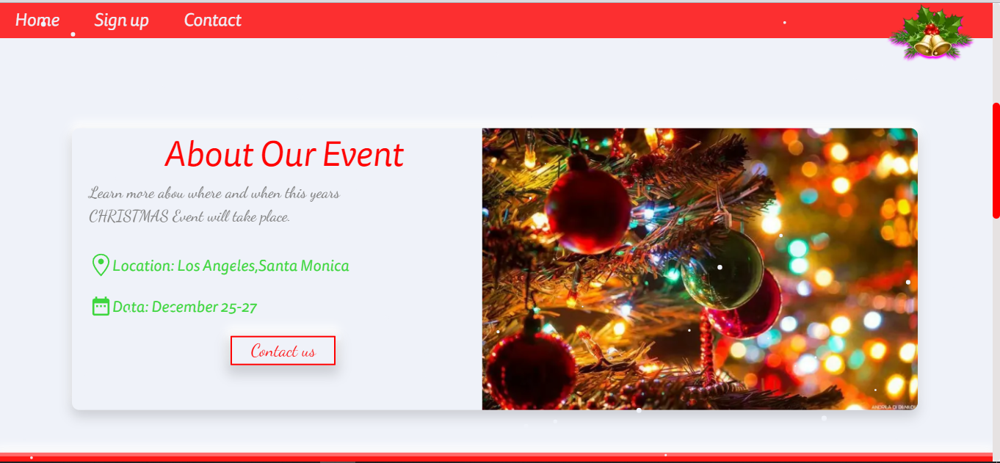
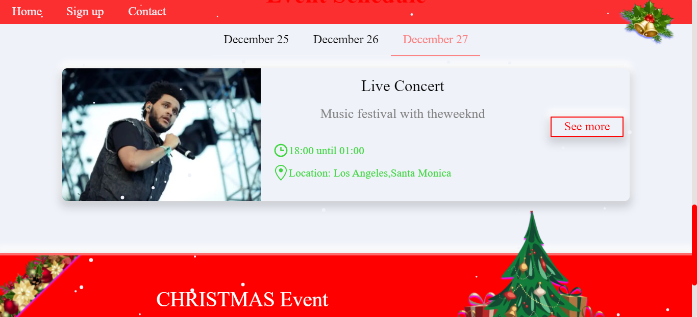

<h1>Christmas Event Website 🎄🎄🎄</h1> 

  
  
  

<h2>📁Demo</h2>
<a href="https://loving-kepler-ae4567.netlify.app/">https://loving-kepler-ae4567.netlify.app/</a> 
<h3>🔴using with:</h3>

📌react scroll parallax

📌react snow fall

📌react fast marquee>

📌chakra-js

📌react-hook/window-size>

📌& ETC...

<h2>📙Frame work: Next.js</h2>

   
  

-how to use it ⁉

📤Copy this files in your Next app

